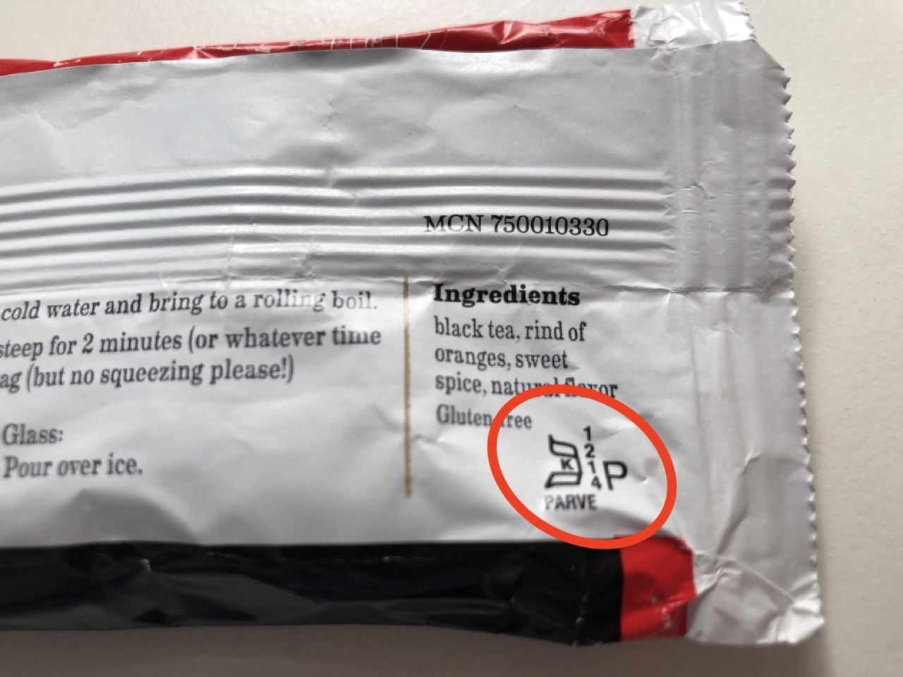

## Einführung in das rabbinische Judentum

### Rabbinisches Judentum von Innen und Außen

Sommersemester 2023  
Prof. Dr. Nathan Gibson

## Vorstellungen

### Wer bin ich?

## Wer sind Sie?

Name:  
Studiengang/Jahr:  
Wofür hier:  
Nichtwissenschaftliche Interessen:  

## Nur für sich

Ihre Ziele: 

- inhaltlich: z.B. etwas fremd, mit dem Sie sich bekannt machen wollen
{: .fragment}
- wissenschaftliche Kompetenzen: z.B. beim Lesen, Schreiben, Literaturrecherche, Zeitmanagement
{: .fragment}
- sozial: z.B. Führungspotenzial weiterentwickeln, effektivere Zusammenarbeit
{: .fragment}
- seelisch: z.B. mutig mit harten Fragen umgehen
{: .fragment}

## What is going on here?

{: style="height: 400px; margin: auto"}

- How did the rabbis come to have this kind of authority? 
- Why is rabbinic Judaism the variety that is widespread and known?

## Lehrplan: Wichtige Links

(meistens mit **23rabbinisch**)

- Website: [https://**23rabbinisch**.pages.gwdg.de/](https://23rabbinisch.pages.gwdg.de/)  
- OLAT: [https://olat-ce.server.uni-frankfurt.de/olat/auth/RepositoryEntry/18063786011](https://olat-ce.server.uni-frankfurt.de/olat/auth/RepositoryEntry/18063786011)  
- Zotero: [https://zotero.org/groups/**23rabbinisch**/library](https://zotero.org/groups/23rabbinisch/library)
- Etherpad: [https://etherpad.studiumdigitale.uni-frankfurt.de/p/**23rabbinisch**1](https://etherpad.studiumdigitale.uni-frankfurt.de/p/23rabbinisch1) (_am Ende 2, 3 usw. für jede Sitzung_)
- Chat: [https://chat.studiumdigitale.uni-frankfurt.de/channel/23rabbinisch](https://chat.studiumdigitale.uni-frankfurt.de/channel/23rabbinisch) 

## Lehrplan: Sprechstunden

Büro: IG-Farben-Haus 6.552  

- Mittwoch 10–11 Uhr (ohne Termin)
- Mittwoch 11–12 Uhr (mit Termin, Terminbuchung auf [npgibson.com/m/sprechstunden](http://npgibson.com/m/sprechstunden))
- Freitag 13–14 Uhr (per **Zoom** mit Termin, Terminbuchung auf [npgibson.com/m/sprechstunden-zoom](http://npgibson.com/m/sprechstunden-zoom))

## Cookies!

{: style="height: 500px"}

Chocolate-chip hazelnut

## Lehrplan: Hintergrund & Zielsetzung

Die Entstehung des rabbinischen Judentums im ersten Jahrtausend nach der Tempelzerstörung durch dessen Auseinandersetzung mit nicht-rabbinischen Bewegungen zu erfassen.

## Lehrplan: Erwartungen

- Anwesenheit
- Lektüren
- Diskussionen
- respektvoller Umgang

### Was sind Ihre Erwartungen?
{: .fragment}

[https://etherpad.studiumdigitale.uni-frankfurt.de/p/23rabbinisch1](https://etherpad.studiumdigitale.uni-frankfurt.de/p/23rabbinisch1)
{: .fragment}

## Lehrplan: Prüfungsleistungen und Prüfungsform

- Abfrage

## Lehrplan: Zeitplan und Lektüren

S. [https://23rabbinisch.pages.gwdg.de/](https://23rabbinisch.pages.gwdg.de/)  

- meistens verlinkt über die UB mit HRZ-Login
- Alle Literature auf [https://www.zotero.org/groups/23rabbinisch/library](https://www.zotero.org/groups/23rabbinisch/library)

## Lehrplan: Inklusion, Barrierefreiheit und Unterstützung

- Vielseitige Beratungsangebote: [https://www.uni-frankfurt.de/91919538/Beratung__\_Unterst%C3%BCtzung](https://www.uni-frankfurt.de/91919538/Beratung___Unterst%C3%BCtzung)
- Barrierefreiheit beim Studium: [https://www.uni-frankfurt.de/83577918/Wege_zu_Studium_und_Beruf_ohne_Barrieren__\_Willkommen](https://www.uni-frankfurt.de/83577918/Wege_zu_Studium_und_Beruf_ohne_Barrieren___Willkommen)
- Psychotherapeutische Beratung: [https://www.uni-frankfurt.de/120593878/Angebote_der_PBS](https://www.uni-frankfurt.de/120593878/Angebote_der_PBS)

## Lehrplan: Hausarbeiten

- Beratungstermin bei mir buchen
- **Keine Plagiate!**
- Schreibkompetenz mithilfe des Schreibzentrums ausrüsten: [https://www.starkerstart.uni-frankfurt.de/82728115/Schreibberatung](https://www.starkerstart.uni-frankfurt.de/82728115/Schreibberatung)

## Sprache

## Vorschau nächste Sitzung