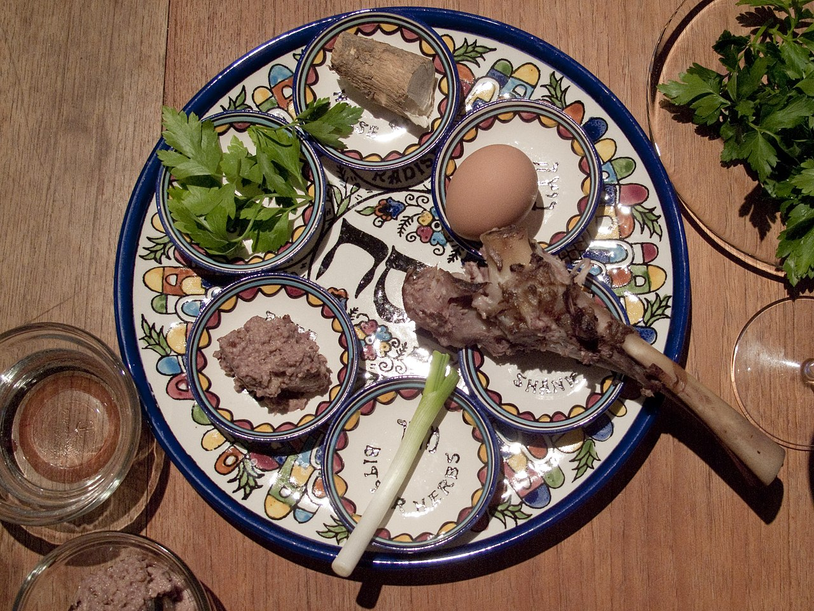

## 2. Temple

### Einführung in das rabbinische Judentum

Sommersemester 2023  
Prof. Dr. Nathan Gibson

## Pesach

{: style="height: 500px; margin: auto"}

<a href="https://commons.wikimedia.org/wiki/File:Gastronomie_juive_en_%C3%89gypte_(cropped).jpg">RCB **</a>, <a href="https://creativecommons.org/licenses/by/2.0">CC BY 2.0</a>, via Wikimedia Commons

## Upcoming

{: .fragment style="height: 900px; margin: auto"}

## Review

"Rabbanization"/Rabbinisierung

## Lernziel

List some ideas and practices that continued from temple life into rabbinic movements.

## Gruppenarbeit

Ereignisse - 2. Tempel

## Erklärung

jüdische Gruppen

## Lektüre

nachhaltige Themen für das rabbinische Judentum:
- Tempel
- Tora/Tanakh (und deren Interpretation)
- innere Diversität

## Mishnah Pesachim 10.3

[Mishnah Pesachim 10.3](https://www.sefaria.org/Mishnah_Pesachim.10.3?lang=bi)

## Lektüre 

wissenschaftliche Herausforderungen zur Forschung des rabb. Judentums

## Vorschau nächste Sitzung