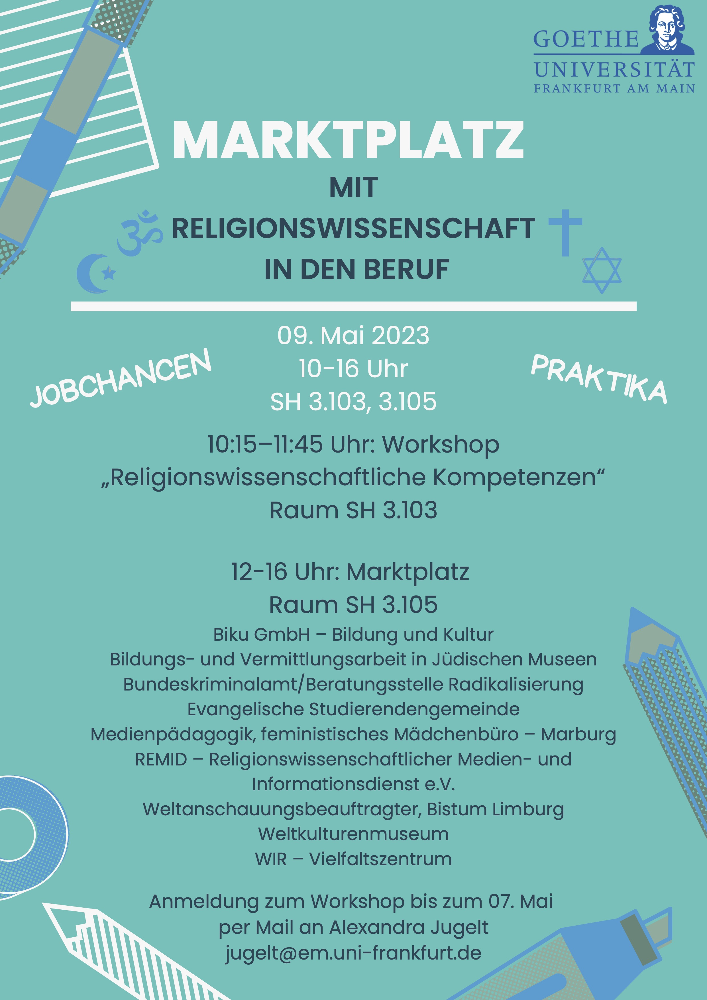
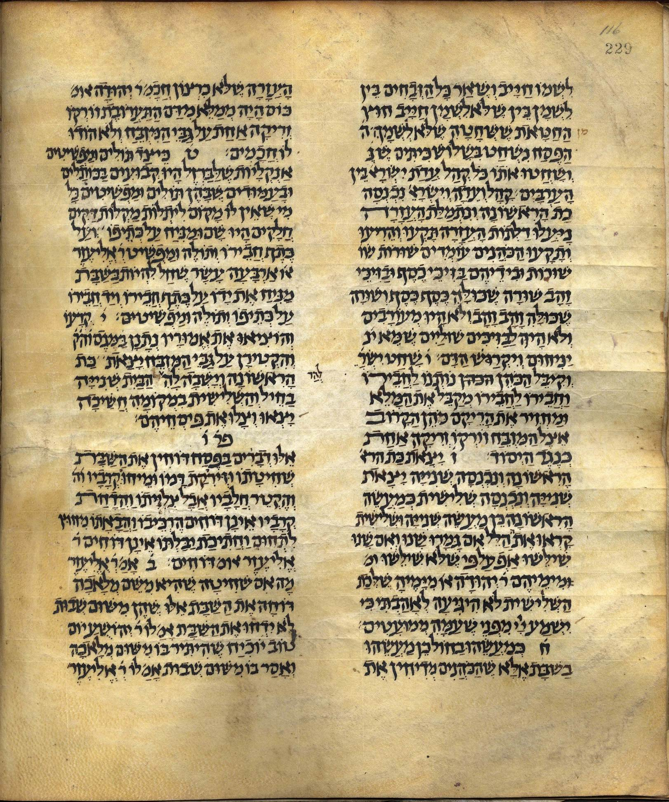
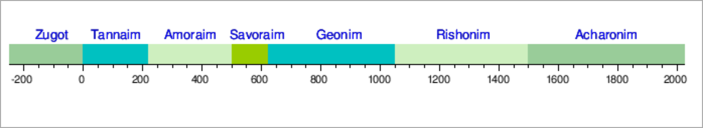
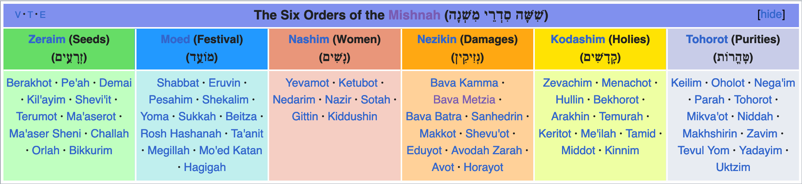

## 4. Mishnah

### Einführung in das rabbinische Judentum

Sommersemester 2023  
Prof. Dr. Nathan Gibson

<!-- ## Hook  -->

## Upcoming

Nächste Woche: **Anfang um 14:45!**

{: .fragment style="height: 900px; margin: auto"}

## Sprechstunden

morgen 10-11h  
Sugar Cookies

## Review: Synagogue & Piyyut

## Lernziel

Explain how the Mishnah illuminates rabbinic attempts to define communal boundaries.

## Oralität

- bei Rot stehen, bei Grün gehen
- rechts vor links
- Reißverschlussverfahren
- "halber Tacho" (halben Tachowert Abstand halten)

## Gliederung

1. Erklärungen
   1. What is the Mishnah?
   2. Mishnah with other rabbinic texts
   3. Organization of the Mishnah
2. Gruppenarbeit: Mischna-Lektüre
3. Exkurs: Science Fiction
4. Diskussion: Mischna als Quelle für die Rabbinisierung

## What is the Mishnah?

<figcaption>
Source: https://archive.org/details/Mishnah_Kaufman_ms, Public Domain.
</figcaption>

## Mishnah with other rabbinic texts

<figcaption>
Source: https://en.wikipedia.org/wiki/Tannaim, CC BY SA 3.0.
</figcaption>

## Organization of the Mishnah

<figcaption>
Source: https://en.wikipedia.org/wiki/Talmud, CC BY SA 3.0.
</figcaption>

## Gruppenarbeit 

- Worum geht es?
{: .fragment}

- Was ist der Regel? (In welcher Situation?)
{: .fragment}

- Wer ist im Text gennant?
{: .fragment}

- Was ist offen bzw. unentschieden gelassen? 
{: .fragment}

Regel lesen > Verhalten lernen > Lernen lernen bzw. Rituell ausüben
{: .fragment}

## Exkurs: Science Fiction

<figcaption>
Image by <a href="https://pixabay.com/users/tombud-1908037/?utm_source=link-attribution&amp;utm_medium=referral&amp;utm_campaign=image&amp;utm_content=1855803">Thomas Budach</a> from <a href="https://pixabay.com//?utm_source=link-attribution&amp;utm_medium=referral&amp;utm_campaign=image&amp;utm_content=1855803">Pixabay</a>
</figcaption>

## Diskussion

Wie bildet sich eine rabbinische Gemeinschaft 

1. durch die Inhalte der Mischna?
2. durch die Aktivitäten rund um Mischna-Sammlung und -Lehre? 

## Vorschau nächste Sitzung

<https://23rabbinisch.pages.gwdg.de/5>